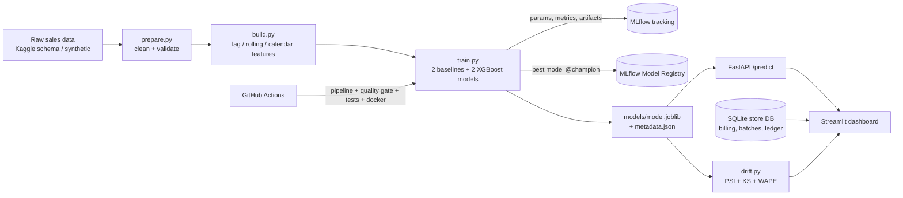

# 💊 Pharmacy Demand Forecasting — End-to-end MLOps Project

A working pharmacy (medical store) management system with a **demand-forecasting model deployed
through a full MLOps pipeline**: versioned data pipeline → experiment tracking → model registry →
API serving → dashboard → drift & performance monitoring → CI/CD with a quality gate → Docker.

> **Business problem.** An Indian medical store loses money two ways: medicines run out (lost sales,
> customers go elsewhere) and medicines expire on the shelf (direct loss). Both come from ordering
> by guesswork. This project forecasts demand, turns it into purchase suggestions, and surfaces expiry
> and dead-stock risk, while running the store's day-to-day billing and inventory.

---

## 1. Architecture



| MLOps stage | Implementation |
|---|---|
| Data pipeline & versioning | `dvc.yaml` stages (or `python -m src.pipeline`), data contract checks in `prepare.py` |
| Feature engineering | Leak-free lags (1/7/14/28), rolling mean/std (7/28), weekday, season (sin/cos) |
| Experiment tracking | **MLflow**: params, metrics (MAE, RMSE, WAPE, bias), per-category WAPE, feature-importance plots |
| Model comparison | naive seasonal, 7-day moving average, XGBoost raw, **XGBoost level-normalised** |
| Model registry | Best model registered as `pharmacy-demand-forecaster` with alias **`@champion`** |
| Serving | **FastAPI** (`/predict`, `/health`, `/model-info`, `/monitoring`), Pydantic validation, request logging |
| Uncertainty | 80 % prediction interval from hold-out residual quantiles |
| Monitoring | Seasonality-aware **data drift** (PSI + KS vs same window last year), **performance** drift (recent WAPE vs hold-out), Evidently HTML report |
| CI / CT | GitHub Actions: pipeline → **quality gate** (must beat baseline) → pytest → Docker build + smoke test; weekly scheduled retrain |
| Packaging | Dockerfile + docker-compose (API, dashboard, MLflow UI) |
| Testing | 16 tests: feature leakage, forecast shape/intervals, drift, API contract, FEFO billing, prescription rules, transaction rollback, audit ledger |

## 2. Store features (what medical stores use daily)

| Module | Features |
|---|---|
| **Billing (POS)** | Barcode scan / type-ahead search, FEFO batch auto-pick, never sells expired stock, MRP-inclusive GST split (CGST/SGST), line & bill discounts, Cash/UPI/Card/Credit, **Schedule H/H1 checks** (doctor + patient required), same-composition substitutes when out of stock, printable GST tax invoice, sales returns, today's bills & cash drawer, keyboard shortcuts (Enter / Ctrl+Enter / Esc) |
| **Inventory** | Stock by medicine & batch, days-of-cover & stock-out date, rack location, stock audit adjustments, **append-only stock ledger** (DB triggers block edits/deletes), add medicine |
| **Purchases** | GRN entry from distributor bill (batch, expiry, free qty, rate, MRP, GST), margin check, purchase history & payables, **expiry/breakage returns with credit-note tracking** |
| **Suppliers** | Scorecard: delivery days, fill rate, short supplies, payables, pending claims, reliability score; price comparison across suppliers |
| **Customers** | Customer history, **refill reminders** for chronic medicines (WhatsApp link), credit (udhaar) ledger & payments, consent capture |
| **Reports** | Sales summary, profit by medicine, GST summary by rate, **Schedule H1 register**, sales register, CSV export |
| **Expiry & dead stock** | Expiry buckets, **expiry-risk engine** (projected unsold units before expiry with FEFO), dead & slow stock, suggested actions |
| **Forecast & reorder** | Category forecasts with intervals, purchase suggestions = demand over lead time + cover + safety stock − stock |
| **Model monitoring** | Champion info, model comparison, per-category accuracy, drift & performance, MLflow runs, API health |

## 3. Run it

**Requires Python 3.11 or 3.12.** Check with `python3 --version`. On Mac you can install it with `brew install python@3.11`.

```bash
cd pharmacy-mlops
python3.11 -m venv .venv && source .venv/bin/activate
pip install -r requirements.txt

python -m src.pipeline                       # data -> features -> train -> register -> drift (~20 s)

# terminal 1 - model API
uvicorn api.main:app --port 8000             # docs at http://localhost:8000/docs
# terminal 2 - dashboard
streamlit run app/main.py                    # http://localhost:8501
# terminal 3 (optional) - MLflow UI
mlflow ui --backend-store-uri sqlite:///mlflow.db --port 5000

pytest -q                                    # 16 tests
```

With Docker, run `docker compose up --build`. That starts the API on :8000, the dashboard on :8501 and MLflow on :5000.

With DVC, run `dvc init` then `dvc repro`. Change `params.yaml`, run `dvc repro` again, and only the affected stages re-run.

**Using the real Kaggle data.** Download *"Pharma sales data"* (file `salesdaily.csv`) into `data/raw/`, set `data.source: kaggle` in `params.yaml`, and re-run the pipeline. The synthetic generator uses the same schema: `datum` plus 8 ATC category columns. That dataset ends in 2019, so the store dashboard will still use recent synthetic dates.

**Resetting the demo store.** Run `python -c "from app import db; db.init_db(force=True)"`.

## 4. Demo script for the viva (about 5 minutes)

1. **Dashboard.** Walk through today's KPIs and the "Needs your attention" list: expiry loss, expired stock, dead stock and refills.
2. **Billing.** Scan `8901000087109` (Paracetamol 650) and press Enter. Type `alprazolam 0.25`. The app now asks for the doctor and patient because the drug is Schedule H1. Save the bill (Ctrl+Enter) and show the GST invoice with the FEFO batch.
3. **Expiry & dead stock.** Show the expiry-risk engine and explain the formula in the expander.
4. **Forecast.** Show the Paracetamol forecast and its prediction band, the purchase suggestions, and the "Served by: API" indicator.
5. **MLOps.** Show that the champion beats the baselines, the drift table, and the MLflow runs. Open the MLflow UI.
6. **Code.** Show `ci.yml` (quality gate), `train.py` (registry and alias) and `drift.py`. Run `pytest -q`.

## 5. Design decisions (good viva answers)

* **Why level-normalised XGBoost?** Tree models cannot extrapolate growth. Predicting `sales / (28-day mean + 1)` lets one global model learn weekday and season shapes that are shared across high- and low-volume categories. It lowered WAPE from 35.4 % to 33.9 % and removed most of the bias.
* **Why WAPE and not MAPE?** Low-volume categories have days with zero sales, which makes MAPE divide by zero. WAPE weights errors by volume.
* **Why seasonality-aware drift?** Comparing September against the whole year flags every monsoon fever season as "drift". So the recent 30 days are compared with the same window last year, together with a performance check.
* **Why a quality gate?** CI fails if the champion does not beat the naive baseline. That stops a broken model from being deployed.
* **Why rules rather than ML for expiry and dead stock?** A transparent formula is enough there, and the owner can verify it. ML is used only where it adds value, which is demand.
* **Human in the loop.** Forecasts are suggestions, the pharmacist confirms every prescription sale, and the system never makes clinical decisions.

## 6. Limitations (be upfront about these)

* The sales data is **synthetic**, generated with realistic Indian seasonality. Accuracy on real store data will differ.
* Daily sales are noisy, so a single day's forecast is uncertain. Weekly totals are much more reliable.
* Schedule H/H1 classifications and GST rates in the demo catalogue are **illustrative**. Verify them against current notifications before any real use.
* This is single-store and uses SQLite. A production version would need PostgreSQL, authentication and roles, multi-branch support, backups and offline sync.

## 7. Project structure

```
pharmacy-mlops/
├── params.yaml            # all configuration
├── dvc.yaml               # reproducible pipeline stages
├── src/
│   ├── data/              # generate.py, prepare.py (validation)
│   ├── features/build.py  # leak-free features
│   ├── models/            # train.py (MLflow + registry), wrapper.py, predict.py
│   ├── monitoring/drift.py
│   └── pipeline.py        # run everything
├── api/main.py            # FastAPI serving
├── app/                   # Streamlit dashboard
│   ├── main.py            # navigation
│   ├── db.py              # schema, seed data, billing/purchase/returns logic
│   ├── analytics.py       # expiry risk, dead stock, supplier score, reorder
│   └── pages/             # 10 screens
├── tests/                 # pytest suite
├── Dockerfile, docker-compose.yml
└── .github/workflows/ci.yml
```
